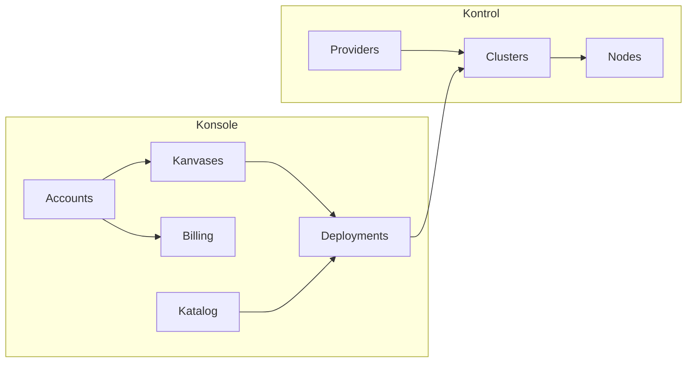

# Product Overview

> What the product is, its language, its domains, and its capabilities.
> This is the single source of truth for product-level meaning.

**Companion files:** [discovery.md](./discovery.md) (open questions, hypotheses),
[figma.md](./figma.md) (design file registry).

---

## What This Product Is

Orkestra is an **open-source PaaS ecosystem** that makes deploying and managing
apps effortless for non-technical users. Kubernetes runs underneath but is
completely invisible — users never see a pod, a node, or a YAML file.

The ecosystem has two products:

| Product | Audience | Purpose |
|---|---|---|
| **Konsole** | End users (beginners, indie hackers, small teams) | Deploy and manage apps through a visual, spatial interface |
| **Kontrol** | Operators / self-hosters | Provision and manage Kubernetes clusters across cloud providers and bare metal |

Both products are beautifully designed. Kontrol is more technical in scope but
holds the same design bar as Konsole — no ugly admin panels.

---

## Glossary

Use these terms consistently in code, UI, specs, and conversation.
Update this section when a term is introduced, renamed, split, or retired.

### Canonical Terms

| Term | Definition |
|---|---|
| Orkestra | The overall ecosystem / brand |
| Konsole | The user-facing PaaS product — workspaces, Kanvases, app deployment |
| Kontrol | The operator-facing infra tool — cluster provisioning, node management, provider connections |
| Kanvas | A spatial workspace inside Konsole where users see and manage their deployed apps and services |
| Katalog | The panel/list of deployable items (apps, databases, services, templates) that users add to a Kanvas |
| Workspace | A collaboration boundary — users can invite others; contains multiple Kanvases |
| Cluster | A managed group of infrastructure nodes that runs workloads (invisible to Konsole users) |
| Node | A compute instance within a cluster (Kontrol-level concept) |

### Candidate Terms

Terms appearing in discussion but not yet stable enough to canonize:

- _Pipeline_ — deployment automation sequence, needs definition
- _Template_ — pre-built stack in the Katalog (e.g. Next.js + Postgres)

---

## Context Map

Each context owns its language, schemas, and invariants.
Contexts interact only through public APIs — never reach into internals.

### Konsole contexts

| Context | Owns | Depends On | Status |
|---|---|---|---|
| Accounts | Users, workspaces, memberships, auth | — | candidate |
| Kanvases | Kanvas CRUD, layout state, item placement | Accounts | candidate |
| Deployments | App deployment, builds, environment config, logs | Accounts, Kanvases | candidate |
| Katalog | Available services/templates, provider integrations | — | candidate |
| Billing | Subscriptions, plans, usage tracking | Accounts | candidate |

### Kontrol contexts

| Context | Owns | Depends On | Status |
|---|---|---|---|
| Providers | Cloud provider credentials (Hetzner, AWS, GCP), SSH keys | — | candidate |
| Clusters | Cluster lifecycle, architecture selection, K8s provisioning | Providers | candidate |
| Nodes | Node management, scaling, health | Clusters | candidate |

_These boundaries are candidates. Promote to confirmed as implementation validates them._

### Context Rules

1. A context owns its schemas and business rules entirely.
2. A context calls another context only through public functions.
3. If behavior belongs clearly to one context, don't split it across multiple.
4. New concepts go in the glossary first, then into the right context.

---

## Capabilities

Capabilities tie features to outcomes. Every feature should strengthen an
existing capability or justify a new one.

| Capability | Outcome | Product | Primary Context |
|---|---|---|---|
| Visual app management | Users deploy and organize apps on a spatial Kanvas | Konsole | Kanvases, Deployments |
| One-click deploy | Connect a repo, detect stack, deploy — no config | Konsole | Deployments, Katalog |
| Workspace collaboration | Teams share workspaces and Kanvases with invited members | Konsole | Accounts |
| Cluster provisioning | Operators create K8s clusters across providers with a sleek UI | Kontrol | Clusters, Providers |
| Node management | Add, remove, and monitor nodes in clusters | Kontrol | Nodes |
| Usage visibility | Teams understand their resource consumption | Konsole | Billing |

### Near-Term Gaps

- OS-like window interaction model for Kanvas (conceptual, needs design)
- AI-assisted deployment and management (later phase)
- Alerting and notifications
- Audit logging

---

## Adding Content

| To add... | Create in... | Follow format in... |
|---|---|---|
| A core entity | `product/entities/` | `entities/EXAMPLE.md` |
| A business workflow | `product/workflows/` | `workflows/EXAMPLE.md` |
| A feature spec | `product/specs/` | `specs/EXAMPLE.md` |

Keep files small. One concept per file. Text first, diagrams only when they clarify.
