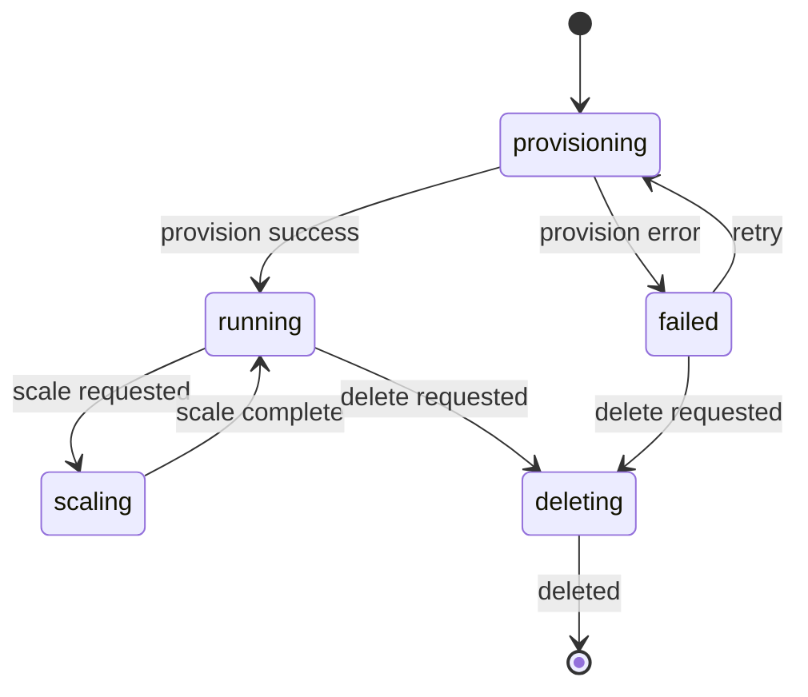

# Cluster

> A managed group of infrastructure nodes that runs workloads.

---

## Purpose

A Cluster is the top-level infrastructure resource. It provides the compute
environment where pods are scheduled and run. Users create clusters to isolate
workloads by team, environment, or purpose.

---

## Ownership

- **Primary context:** Infrastructure
- **Used by:** Deployments (as deployment target), Billing (usage tracking)

---

## Core Attributes

| Attribute | Type | Required | Meaning |
|---|---|---|---|
| name | string | yes | Human-readable identifier, unique per team |
| region | string | yes | Geographic region (e.g., us-east-1) |
| status | enum | yes | Current lifecycle state |
| node_count | integer | no | Number of nodes currently in the cluster |

---

## State Model

---

## Invariants

- A cluster name must be unique within a team.
- A cluster must have at least one node to reach `running` status.
- A cluster cannot be deleted while it has running deployments.
- Only clusters in `running` status can accept new deployments.

---

## Related Workflows

- [Provision Cluster](../workflows/EXAMPLE.md)

---

## Open Questions

- Should clusters support pausing (scale to zero) vs. deleting?
- How should cross-region clusters work?
